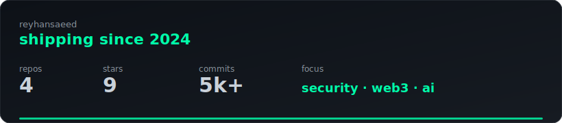

<div align="center">

# Rey

builder · security research · web3 · automation

[](https://x.com/risingrey)
[](https://github.com/reyhansaeed)
[](https://github.com/reyhansaeed)

</div>

---

```text
$ whoami
> rey — shipping code since 2024. security research, web3 tooling,
  automation systems, and AI infrastructure.

$ ls ~/capabilities/
> security-research/   web3-defi/           automation/
> ai-infrastructure/   reverse-engineering/
```

---

<table>
<tr>
<td width="50%" valign="top" align="center">

### 🔐 Security Research

Smart contract audits · exploit analysis  
Web app recon · CTF · bug bounty  
DeFi protocol deep-dives

</td>
<td width="50%" valign="top" align="center">

### ⛓ Web3 & On-chain

Multi-chain tooling · wallet ops  
Airdrop infra · NFT mint automation  
Swap / bridge aggregators

</td>
</tr>
<tr>
<td width="50%" valign="top" align="center">

### ⚙️ Automation

Browser agents · account pipelines  
API reverse engineering · anti-bot  
Cron systems · Telegram bots

</td>
<td width="50%" valign="top" align="center">

### 🧠 AI Infrastructure

Agent orchestration · skill systems  
Model routing · context compression  
Self-hosted LLM proxies

</td>
</tr>
</table>

---

<div align="center">

### stack


</div>

---

<div align="center">

### metrics



</div>

---

<div align="center">

### featured

[](https://github.com/reyhansaeed/chain-balance)

</div>

---

<div align="center">

<sub>code · build · ship · repeat</sub>

</div>
